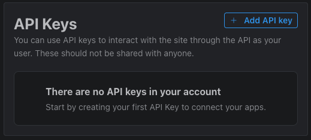
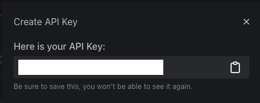
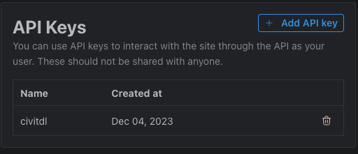

# API Key
- In this page, we will go over the instructions to get an API Key from civitai.com

 

## Navigate
- [README Page](/README.md)
- [Alias Page](/doc/alias.md)
- [API Key Page](/doc/api_key.md)
- [Civitconfig / Configuration Page](/doc/civitconfig.md)
- [Civitdl Page](/doc/civitdl.md)
- [Sorter Page](/doc/sorter.md)

 

## Table Of Contents
- [API Key](#api-key)
  - [Navigate](#navigate)
  - [Table Of Contents](#table-of-contents)
  - [Why do we need to add an API Keys?](#why-do-we-need-to-add-an-api-keys)
  - [Steps to get API Key from civitai.com](#steps-to-get-api-key-from-civitaicom)
  - [Using the API Key for one batch](#using-the-api-key-for-one-batch)
  - [Using the API Key as default key for all batches](#using-the-api-key-as-default-key-for-all-batches)

 

## Why do we need to add an API Keys?

Some model authors require users to be logged in to download their model. It has happened for some models like this [model](https://civitai.com/models/191977).

 

## Steps to get API Key from civitai.com

1. Go to civitai.com.

2. Log in and click on your profile on the top right.

3. Click on account settings.

4. Scroll to API Key section.

5. Click the **Add API key** button.

6. Enter the name `civitdl` for the API key name.

7. Copy your API key and save it somewhere.

8. After saving your key somewhere and refreshing the page, you should see `civitdl` listed as one of your API keys.

 

## Using the API Key for one batch

It is very simple to use the api key. Just add an option `-k` or `--api-key` with no value, and the program will prompt you for your key secretly.

Example:
- Shorthand: `civitdl 191977 ./models -k`
- Longhand: `civitdl 191977 ./models --api-key`

 

## Using the API Key as default key for all batches

Run the following to set the API key
- Shorthand: `civitconfig default -k`
- Longhand: `civitconfig default --api-key`

Once that is done, you can download authenticated-user only models without specifying `-k` or `--api-key` when running `civitdl`
  - `civitdl 191977 ./models`

